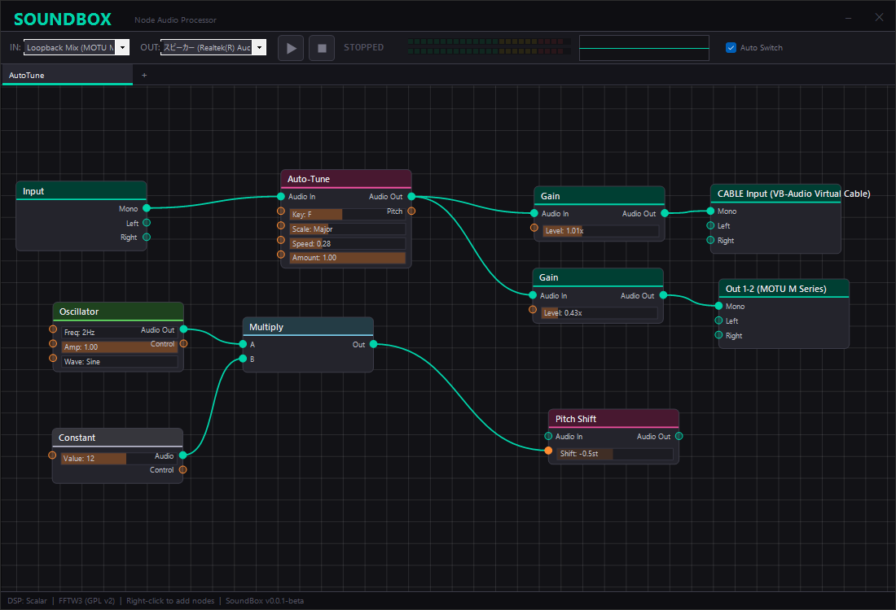

# SoundBox

Node-based virtual audio processor for Windows.

SoundBox is a voice changer app that you can start using right after installation.
By freely connecting effects composed of nodes, you can create sounds with complete freedom.

SoundBoxは，インストールしてすぐに使えるボイスチェンジャーアプリのようなものです．
ノードで構成されるエフェクトを好きにつなぐことで，自由な音作りをすることができます．

> [!WARNING]
> Since this is a beta version, switching presets may not work properly.
> For stable operation, please launch the app with only one graph tab open in the current version.   
> βバージョンのためプリセットの切り替えがうまくいかないことがあります．
> 安定動作のため現バージョンではグラフタブを一つに絞って起動してください．

## 特徴

Supports output to multiple devices. We recommend using VA Cable (Virtual Cable) especially when you want to send input to other apps like Discord, game voice chat, or Audacity.

Specify the VA Cable's Input in the OutputNode, and specify the VA Cable's Output in apps like Discord. This allows you to route SoundBox audio to any desired application.

All Parameters can receive values from other nodes (Output: green edges).
This means you can receive waveforms generated by the oscillator (sine wave) as input values for the parameters.

---

複数のデバイス出力に対応します．特にDiscordやゲームVC, Audacityなどのほかのアプリへ入力したい場合は，VA Cable(仮想ケーブル)を使用することをお勧めします．

OutputNodeにVA CableのInputを指定し，Discord等のアプリではVA CableのOutputに指定することで，任意のアプリにSoundBoxの音を流すことができます．

Parameterはすべてほかのノードの値 (Output: 緑色のエッジ)を受け取ることができます．
つまり，オシレータ(sin波)で生成した波形をパラメータの入力値として受け取ることができます．

## Acknowledgments

This project uses the following open-source software:

### FFTW3 — Fastest Fourier Transform in the West

- **Authors**: Matteo Frigo, Steven G. Johnson (Massachusetts Institute of Technology)
- **License**: [GNU General Public License v2](http://www.gnu.org/licenses/old-licenses/gpl-2.0.html)
- **Website**: [https://www.fftw.org/](https://www.fftw.org/)

> FFTW is a C subroutine library for computing the discrete Fourier transform (DFT).
> SoundBox uses FFTW3 for real-time pitch detection and correction in the Auto-Tune and Pitch Shift nodes.
>
> Copyright (c) 2003, 2007-2014 Matteo Frigo
> Copyright (c) 2003, 2007-2014 Massachusetts Institute of Technology

### NAudio — .NET Audio Library

- **Author**: Mark Heath
- **License**: [MIT License](https://opensource.org/licenses/MIT)
- **Repository**: [https://github.com/naudio/NAudio](https://github.com/naudio/NAudio)

> NAudio is an open-source .NET audio library.
> SoundBox uses NAudio (v2.2.1) for WASAPI audio capture and playback.
>
> Copyright (c) Mark Heath

## License

This project is licensed under the GNU General Public License v2. See [LICENSE](LICENSE) for details.
